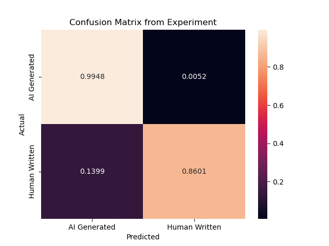

# AI-Text-Detector-Validation

This repository serves as an appendix for my final project in Technique Writing class.

## Overview

The code in this repository will test the performance of Originality.AI, a AI text detector, on the texts from GPT-wiki-intro, a public dataset consisting of Wikipedia introductions and GPT-generated introductions for 150,000 topics. The program will randomly sample 200 human-written texts and 200 GPT-generated texts from the dataset as the testing data. Then, the program will feed the testing data to Originality.AI through its API and use the results of classifications to evaluate the accuracy. Finally, by counting the number of true positives, true negatives, false positives, and false negatives, the program will generate a performance matrix for better visualization and further analysis.

## Preparation

1. a Python environment
2. Buy the API service of  [Originality.AI](https://app.originality.ai/api-access) and generate an API key.
3. Download the .csv file of the [GPT-wiki-intro](https://huggingface.co/datasets/aadityaubhat/GPT-wiki-intro) dataset and place it under this directory.


## Run

### Step 1: Pass your API key

In *main.py*, find line 29:

```python
GZA = OAAPI("----API from Originality.AI----")
```

Replace the text in the parenthesis with the API key you got in the preparation.

### Step 2: run the code

run the *main.py* by the following command:

```shell
python main.py
```


## Example

Here is a sample output which is a performance matrix from our program:


